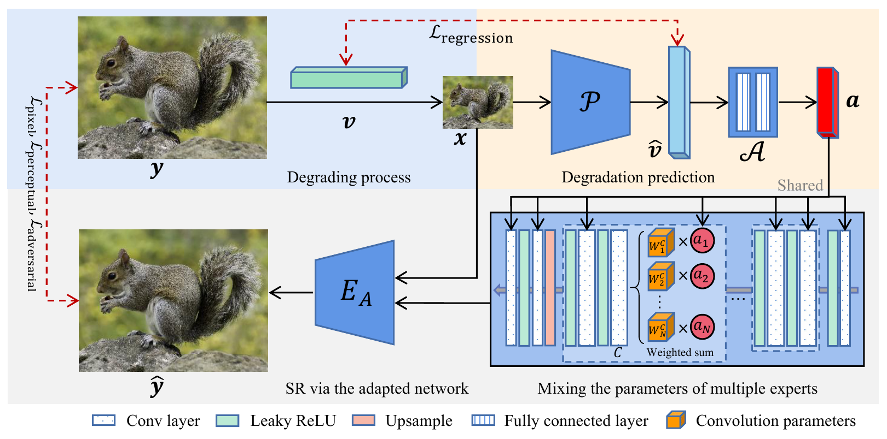

# DASR

### [Paper](http://www4.comp.polyu.edu.hk/~cslzhang/paper/ECCV2022_DASR.pdf) | [Supplementary Material](http://www4.comp.polyu.edu.hk/~cslzhang/paper/ECCV2022_DASR_supp.pdf)

> **Efficient and Degradation-Adaptive Network for Real-World Image Super-Resolution** <br>
> [Jie Liang](https://liangjie.xyz/), [Hui Zeng](https://huizeng.github.io/), and [Lei Zhang](https://www4.comp.polyu.edu.hk/~cslzhang/). <br>
> In ECCV 2022.

### Abstract

Efficient and effective real-world image super-resolution (Real-ISR) is a challenging task due to the unknown complex degradation of real-world images and the limited computation resources in practical applications. Recent research on Real-ISR has achieved significant progress by modeling the image degradation space; however, these methods largely rely on heavy backbone networks and they are inflexible to handle images of different degradation levels. In this paper, we propose an efficient and effective degradation-adaptive super-resolution (DASR) network, whose parameters are adaptively specified by estimating the degradation of each input image. Specifically, a tiny regression network is employed to predict the degradation parameters of the input image, while several convolutional experts with the same topology are jointly optimized to specify the network parameters via a non-linear mixture of experts. The joint optimization of multiple experts and the degradation-adaptive pipeline significantly extend the model capacity to handle degradations of various levels, while the inference remains efficient since only one adaptively specified network is used for super-resolving the input image. Our extensive experiments demonstrate that DASR is not only much more effective than existing methods on handling real-world images with different degradation levels but also efficient for easy deployment.

Overall pipeline of the DASR:



For more details, please refer to our paper.

#### Getting started

- Clone this repo.
```bash
git clone https://github.com/csjliang/DASR
cd DASR
```

- Install dependencies. (Python 3 + NVIDIA GPU + CUDA. Recommend to use Anaconda)
```bash
pip install -r requirements.txt
```

- Prepare the training and testing dataset by following this [instruction](datasets/README.md).
- Prepare the pre-trained models by following this [instruction](experiments/README.md).

#### Training

First, check and adapt the yml file ```options/train/DASR/train_DASR.yml```, then

- Single GPU:
```bash
PYTHONPATH="./:${PYTHONPATH}" CUDA_VISIBLE_DEVICES=0 python dasr/train.py -opt options/train/DASR/train_DASR.yml --auto_resume
```

- Distributed Training:
```bash
YTHONPATH="./:${PYTHONPATH}" CUDA_VISIBLE_DEVICES=0,1,2,3 python -m torch.distributed.launch --nproc_per_node=4 --master_port=4335 dasr/train.py -opt options/train/DASR/train_DASR.yml --launcher pytorch --auto_resume

```

Training files (logs, models, training states and visualizations) will be saved in the directory ```./experiments/{name}```

#### Testing

First, check and adapt the yml file ```options/test/DASR/test_DASR.yml```, then run:
```bash
PYTHONPATH="./:${PYTHONPATH}" CUDA_VISIBLE_DEVICES=0 python basicsr/test.py -opt options/test/DASR/test_DASR.yml
```

Evaluating files (logs and visualizations) will be saved in the directory ```./results/{name}```

### License

This project is released under the Apache 2.0 license.

### Citation
```
@inproceedings{jie2022DASR,
  title={Efficient and Degradation-Adaptive Network for Real-World Image Super-Resolution},
  author={Liang, Jie and Zeng, Hui and Zhang, Lei},
  booktitle={European Conference on Computer Vision},
  year={2022}
}
```

### Acknowledgement
This project is built based on the excellent [BasicSR](https://github.com/xinntao/BasicSR) project.

### Contact
Should you have any questions, please contact me via `liang27jie@gmail.com`.
